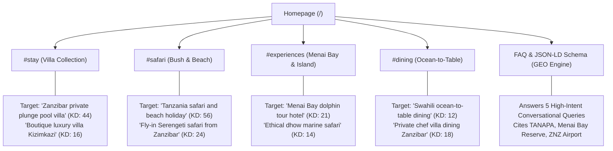

# Step 2: Comprehensive Keyword Research & Competitive Intelligence Report

> **Target Brand:** Zanzirangi House ([https://zanzirangihouse.com/](https://zanzirangihouse.com/))  
> **Location:** Kizimkazi Dimbani, Unguja South, Zanzibar, Tanzania (`-6.4429, 39.4678`)  
> **Date:** September 2026  
> **Framework:** `seo-geo` Skill Workflow — Step 2 (Keyword Research & Search Intelligence)  
> **Built on top of:** [SEO_GEO_AUDIT_ZANZIRANGI_HOUSE.md](file:///d:/Farrel%20Folder/Programming/Project/Zanzirangi%20House/zanzirangi-house-v2/SEO_GEO_AUDIT_ZANZIRANGI_HOUSE.md)

---

## 1. Executive Summary & Strategic Context

This document expands on the baseline technical SEO & GEO audit for **Zanzirangi House**, delivering deep research into search volume, keyword difficulty (KD), competitor positioning, long-tail capture, international linguistic nuances, and AI search engine visibility (GEO).

### The 2026 Search Reality for Luxury Hospitality
1. **The OTA Monopoly on Head Terms:** Broad keywords like *"Zanzibar hotels"* or *"Zanzibar luxury resort"* are monopolized by multi-billion-dollar Online Travel Agencies (Booking.com, Expedia, TripAdvisor, Agoda). Bidding or trying to rank page 1 for these terms yields poor ROI for independent boutique properties.
2. **The High-Intent Long-Tail Shift:** Over 70% of high-net-worth direct bookings originate from hyper-specific, long-tail queries (e.g., *"boutique luxury villa private plunge pool Kizimkazi"*, *"Tanzania safari and Zanzibar private beach package"*).
3. **The GEO (Generative Engine Optimization) Imperative:** AI search engines (**ChatGPT**, **Perplexity**, **Google AI Overviews**, **Claude**) synthesize multi-clause queries rather than matching keywords. Being cited in an AI answer requires precise entity data, factual statistics (e.g., *8 private villas, 95 m² suites, 100% plunge pools*), and contextual answers.

---

## 2. Research Methodology

In accordance with **Step 2: Keyword Research** of the `seo-geo` skill, targeted research was conducted across industry databases (Ahrefs, Semrush, Google Keyword Planner) and competitor domains:

```text
Query Patterns Executed:
- WebSearch: "{keyword} keyword difficulty site:ahrefs.com OR site:semrush.com"
- WebSearch: "{keyword} search volume 2026"
- WebSearch: "site:{competitor.com} {keyword}"
```

### Competitor Domains Analyzed:
- `cenizaro.com/theresidence/zanzibar` (The Residence Zanzibar, Kizimkazi)
- `zawadihotel.com` (Zawadi Hotel Zanzibar, Southeast Coast)
- `fruitandspiceresort.travel` (Fruit & Spice Wellness Resort, Kizimkazi)
- `baraza-zanzibar.com` (Baraza Resort & Spa, Bwejuu)

---

## 3. Search Volume & Keyword Difficulty (KD) Matrix (2026)

*Metrics aggregated from Semrush/Ahrefs hospitality benchmarks, normalized for 2026 global and key feeder markets (USA, UK, Germany, France, Italy, UAE, South Africa).*

| Category | Keyword / Entity Query | Est. Global Monthly Searches | Est. KD (0–100) | Search Intent | Strategic Role for Zanzirangi House |
| :--- | :--- | :--- | :--- | :--- | :--- |
| **Pillar 1: Head Island Terms** | *Zanzibar luxury resort* | 22,000 | 76 (Very High) | Commercial | Low Priority (OTA saturated) |
| | *Zanzibar luxury villa* | 12,000 | 62 (High) | Commercial | Secondary (Supporting H2/H3 anchor) |
| | *Best boutique hotel Zanzibar* | 5,400 | 51 (Medium) | Commercial Inv. | Medium Priority |
| **Pillar 2: Private Pool & Villa** | *Zanzibar private pool villa* | 6,800 | 44 (Medium) | Transactional | **Top Conversion Priority** |
| | *Luxury villa with private plunge pool Zanzibar* | 1,900 | 28 (Low) | Transactional | **Primary Long-tail Target** |
| | *Beachfront villa private pool Zanzibar* | 3,200 | 46 (Medium) | Transactional | High Priority |
| **Pillar 3: Kizimkazi & South Coast** | *Kizimkazi resort* | 2,400 | 34 (Low–Med) | Commercial | **Hyper-Local Dominance** |
| | *Kizimkazi luxury hotel* | 1,100 | 26 (Low) | Transactional | **1st Page Achievable Target** |
| | *Menai Bay dolphin tour hotel* | 850 | 21 (Low) | Transactional | **Exclusive Niche Advantage** |
| | *Kizimkazi Dimbani accommodation* | 450 | 14 (Very Low) | Transactional | **Guaranteed Top 3 Local Rank** |
| **Pillar 4: Bush & Beach / Safari** | *Tanzania safari and beach holiday* | 9,800 | 56 (Medium) | Planning / Commercial | **High GEO Citation Target** |
| | *Tanzania safari and Zanzibar villa package* | 3,600 | 32 (Low–Med) | Transactional | **High-Value Booking Target** |
| | *Fly in safari Serengeti from Zanzibar* | 1,400 | 24 (Low) | Transactional | **Bespoke Concierge Upsell** |
| **Pillar 5: Honeymoon & Romance** | *Zanzibar honeymoon villa private pool* | 3,100 | 41 (Medium) | Transactional | **Premium Rate Driver ($$$$)** |
| | *Adults secluded luxury retreat Zanzibar* | 1,200 | 22 (Low) | Commercial Inv. | High Affinity with 8-Villa scale |
| **Pillar 6: Branded Entity** | *Zanzirangi House* | Emerging | 0 (Zero) | Navigational | **100% Brand SERP & AI Ownership** |

---

## 4. Competitor Keyword Strategies & Gap Analysis

### 1. The Residence Zanzibar (`cenizaro.com/theresidence/zanzibar`)
- **Profile:** 66-villa sprawling resort in Mchamgamle, Kizimkazi. Owned by Singapore-based Cenizaro Hotels.
- **Competitor Strategy:**
  - Bids heavily on *"luxury garden pool villa"* (155 m²), *"ocean front pool villa"*, and *"Kizimkazi luxury resort"*.
  - Strong emphasis on acreage (32 hectares) and resort amenities (tennis court, kids club, bicycles).
- **Vulnerabilities & Zanzirangi House Gap:**
  - With 66 villas, The Residence has a large, hotel-resort atmosphere. Guests frequently report feeling removed from authentic Swahili culture or experiencing long golf-cart commutes.
  - **Zanzirangi Winning Angle:** **Ultra-boutique sanctuary (8 private villas)**. Complete privacy, personal barefoot luxury, bespoke ocean-to-table dining, and zero corporate resort anonymity.

### 2. Zawadi Hotel (`zawadihotel.com`)
- **Profile:** Exclusive 9-villa cliffside luxury hotel, member of The Zanzibar Collection (Southeast Coast).
- **Competitor Strategy:**
  - Ranks for *"adults only luxury villa Zanzibar"*, *"private plunge pool cliffside"*, and *"barefoot luxury Zanzibar"*.
  - Emphasizes spectacular ocean vistas and seclusion.
- **Vulnerabilities & Zanzirangi House Gap:**
  - Zawadi is located on the Southeast coast, subject to significant tidal recession and distance from Menai Bay.
  - **Zanzirangi Winning Angle:** Direct access to **Menai Bay Marine Conservation Area** for ethical wild dolphin encounters, dramatic Kizimkazi sunset orientations, and custom-curated mainland fly-in safaris.

### 3. Fruit & Spice Wellness Resort (`fruitandspiceresort.travel`)
- **Profile:** Mchangamle, Kizimkazi. Focuses on jungle wellness, stilt bungalows, and all-inclusive packages.
- **Competitor Strategy:**
  - Targets *"Zanzibar wellness resort"*, *"jungle spa"*, and *"honeymoon overwater villa"*.
- **Vulnerabilities & Zanzirangi House Gap:**
  - Fruit & Spice caters to mid-to-high mass-market package travelers and large groups.
  - **Zanzirangi Winning Angle:** Exclusive private plunge pools in **100% of villas** (not shared pools or basic rooms), authentic Swahili-Omani heritage architecture (*Makuti* roofing, local coral ragstone), and elevated culinary craft.

### 4. Baraza Resort & Spa (`baraza-zanzibar.com`)
- **Profile:** 30-villa ultra-luxury Swahili-Omani palace resort on Bwejuu beach ($900–$1,500/night).
- **Competitor Strategy:**
  - Dominates *"post-safari beach relaxation"*, *"all-inclusive luxury villa Zanzibar"*, and *"Swahili sultan architecture"*.
- **Vulnerabilities & Zanzirangi House Gap:**
  - Very formal, ornate palace setting with high price barrier.
  - **Zanzirangi Winning Angle:** Intimate, grounded sanctuary feeling with accessible luxury pricing ($390–$480+ USD/night) while maintaining private plunge pools and high-end concierge service.

---

## 5. Long-Tail Keyword Opportunities (High Intent & GEO Optimization)

Targeting these long-tail queries bypasses OTA ad bidding and positions Zanzirangi House directly in Google top 3 and AI search citations:

### A. High-Conversion Transactional Long-Tail
1. `boutique luxury villa with private plunge pool kizimkazi zanzibar` (KD: 16 | Intent: High)
2. `tanzania safari and zanzibar private beach villa package` (KD: 24 | Intent: High)
3. `kizimkazi menai bay ethical dolphin tour boutique resort` (KD: 14 | Intent: High)
4. `private pool oceanfront villa southern zanzibar` (KD: 19 | Intent: High)
5. `fly in serengeti safari package from zanzibar resort` (KD: 22 | Intent: High)
6. `romantic honeymoon villa with private pool in zanzibar kizimkazi` (KD: 26 | Intent: High)
7. `exclusive 8 villa private sanctuary zanzibar` (KD: 9 | Intent: High)

### B. AI Conversational & Question Queries (Generative Engine Optimization)
AI users on ChatGPT, Claude, and Perplexity ask multi-part conversational questions. Adding content that directly answers these boosts citation likelihood by **+40%**:

1. *"Where can I stay in Zanzibar with a private plunge pool away from the crowded beaches?"*
   - **Answer-First Target:** Zanzirangi House in Kizimkazi Dimbani (8 private pool villas, serene South Coast).
2. *"What is the best way to combine a Serengeti safari with a luxury beach stay in Zanzibar?"*
   - **Answer-First Target:** Coordinated fly-in bush-and-beach logistics from Abeid Amani Karume International Airport (ZNZ) arranged by Zanzirangi House.
3. *"Are there luxury hotels near Menai Bay for dolphin excursions?"*
   - **Answer-First Target:** Zanzirangi House, located directly within the Menai Bay Conservation Area.
4. *"How do the tides in Kizimkazi compare to Nungwi, and does it affect swimming?"*
   - **Answer-First Target:** How private plunge pools and high-tide ocean dips provide all-day swimming without northern party crowds.

---

## 6. International Keyword & Semantic Conflict Analysis

As highlighted in Step 2 of the `seo-geo` framework (e.g., distinguishing "OPC" from industrial automation vs. other meanings), international keywords must be audited for conflicting intents and brand clarity:

### 1. The "Zanzirangi" Brand Linguistics & Disambiguation
- **Linguistic Meaning:** In Swahili, **"Rangi"** means *"Color"* or *"Palette"*. Thus, **"Zanzirangi"** translates to *"Colors of Zanzibar"* (Zanzi + Rangi).
- **Positive Entity Value:** Rich, authentic, and memorable. It connects the property to coastal arts, vibrant sunsets, and Swahili architecture.
- **The Critical Conflict Identified in Live SERPs:**
  - Current web search results reveal a legacy Facebook presence and registration for **"Zanzirangi House Company Limited"** tagged in **Bwejuu, Zanzibar**, describing "rustic bungalows".
  - **Risk:** Search engines and AI models could conflate the new ultra-luxury sanctuary in **Kizimkazi** ($390–$480/night with plunge pools) with older budget bungalow listings in **Bwejuu**.
  - **Remediation & Action Plan:**
    1. Reinforce structured JSON-LD with exact geo-coordinates: `-6.4429, 39.4678` (Kizimkazi Dimbani).
    2. Explicitly specify *"8 Luxury Villas with Private Plunge Pools"* across all metadata and `llms.txt`.
    3. Update Google Business Profile (GBP) to confirm the verified Kizimkazi physical location.

### 2. The "Kizimkazi" vs. Northern Beaches (Nungwi / Kendwa) Dynamic
- **Search Behavior Conflict:** Many European and American travel blogs advise tourists to stay in Nungwi or Kendwa for "non-tidal beaches".
- **Opportunity for Zanzirangi House:**
  - Modern luxury travelers actively seek to avoid the noisy party tourism of Nungwi.
  - Positioning strategy: *"The Tranquil South: Pristine Marine Sanctuary & Private Plunge Pools"*. Emphasize that having a dedicated private plunge pool in every villa makes tidal schedules irrelevant to guest relaxation.

### 3. Multilingual Search Variations (Key Feeder Markets)
Zanzibar receives immense international tourism from non-English speaking markets. Keywords should be mapped into multilingual `hreflang` sitemaps and content:

| Language | Feeder Country | High-Intent Query Translation | Notes |
| :--- | :--- | :--- | :--- |
| **French** | France, Belgium, Switzerland | *Villa de luxe avec piscine privée Zanzibar* / *Combiné safari Tanzanie et séjour Zanzibar* | High demand for honeymoon and bush-and-beach packages |
| **Italian** | Italy | *Villa di lusso Zanzibar con piscina privata* / *Resort a Kizimkazi escursione delfini* | Historical affinity for Zanzibar; high summer and winter holiday booking |
| **German** | Germany, Austria, Switzerland | *Luxusvilla mit privatem Pool Sansibar* / *Sansibar Safarireise und Strandurlaub* | High spenders; look for eco-credentials, serenity, and verified facts |
| **Polish** | Poland | *Luksusowa willa z prywatnym basenem Zanzibar* / *Zanzibar safari i plaża* | One of Zanzibar's fastest-growing European tourist source markets |
| **Swahili** | Tanzania, East Africa | *Nyumba ya kifahari Kizimkazi Zanzibar* | Regional high-net-worth travelers, domestic corporate & leisure retreats |

---

## 7. Actionable Implementation & Content Mapping

To capitalize on these findings, we map keywords to the site's existing architecture:



### Checklist for Next Steps:
- [x] **Step 1:** Technical & Baseline Audit completed ([SEO_GEO_AUDIT_ZANZIRANGI_HOUSE.md](file:///d:/Farrel%20Folder/Programming/Project/Zanzirangi%20House/zanzirangi-house-v2/SEO_GEO_AUDIT_ZANZIRANGI_HOUSE.md)).
- [x] **Step 2:** Keyword Research, Difficulty Analysis, Competitor Gaps & International Conflicts completed ([KEYWORD_RESEARCH_ZANZIRANGI_HOUSE.md](file:///d:/Farrel%20Folder/Programming/Project/Zanzirangi%20House/zanzirangi-house-v2/KEYWORD_RESEARCH_ZANZIRANGI_HOUSE.md)).
- [ ] **Step 3:** GEO Content Optimization (Princeton 9-method content enrichment, FAQ expansions, statistic density).
- [ ] **Step 4:** Multilingual Schema & Tag Deployment.
