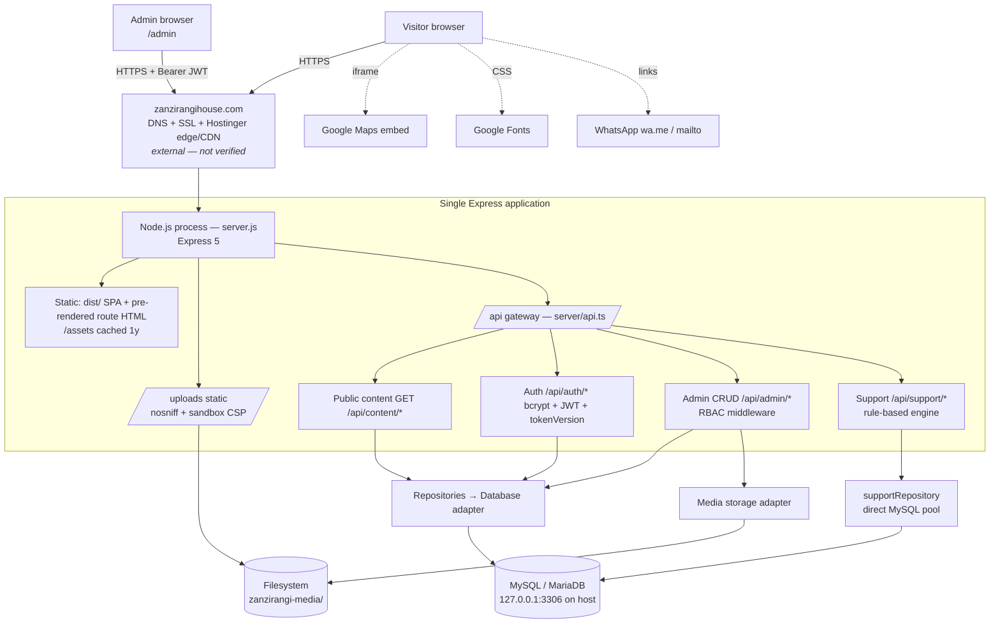

# Zanzirangi Project Brief

| | |
|---|---|
| Document | Project Brief (evidence-based audit) |
| Audit date | 2026-10-01 |
| Audited revision | `main` @ `2379f82` **plus 128 uncommitted working-tree changes** (90 modified tracked files, 38 untracked paths) |
| Method | Static inspection of source, configuration, migrations, scripts and documentation; type-check, dependency audit and client build executed locally. No live server, DNS, hosting panel or production database was accessed. |
| Companion documents | `ZANZIRANGI_SYSTEM_ARCHITECTURE.md`, `ZANZIRANGI_PRODUCTION_READINESS.md`, `ZANZIRANGI_SECURITY_CHECKLIST.md`, `ZANZIRANGI_CLIENT_HANDOVER_CHECKLIST.md` |
| Confidentiality | Internal. No secrets, passwords, database usernames, host names or IP addresses are reproduced in this document. |

**Evidence labels used throughout**

| Label | Meaning |
|---|---|
| VERIFIED | Confirmed directly in source/config in this repository (and, where stated, by a command run during this audit) |
| PARTIALLY VERIFIED | Part of the claim confirmed in code; the remainder depends on runtime/external state |
| INFERRED | Reasonable conclusion from indirect evidence (comments, naming, docs) — not proven |
| NOT VERIFIED | Cannot be determined from available project files ("Requires external verification") |
| NOT FOUND | Searched for and absent |
| PLANNED | Described as future work; not implemented |

---

## 1. Executive Summary

The repository contains a **production-oriented website and custom CMS for Zanzirangi House, a boutique villa / hospitality property in Zanzibar, Tanzania**. It is a single Node.js application: a React 19 single-page application (built with Vite) served by an Express 5 server that also exposes a JSON REST API, backed by MySQL (via `mysql2`), with an authenticated admin dashboard for content management, a role/permission model (Superadmin / Admin + 17 module permissions), a media library with persistent file storage, an audit log, and a visitor chat ("Juma" concierge) with a rule-based auto-responder and human hand-off inbox.

> **Scope discrepancy — important.** The audit request describes the system as representing "Zanzirangi House as a professional software/SaaS company". **The implemented system is a hospitality website** (villas, dining, experiences, safari, transfers, bookings enquiry, Zanzibar location). No SaaS product, client portal, subscription, billing or software-delivery features exist in the code. This brief documents the system as actually built. (VERIFIED — `src/App.tsx`, `index.html` JSON-LD `@type: Resort/LodgingBusiness/Hotel`, `metadata.json`.)

**Overall status: PARTIALLY READY** for production. The CMS, authentication and data layer are well engineered for a project of this size, but there are go-live blockers:

1. The **booking enquiry form does not send data anywhere** — it shows a success screen after a 1-second timer (`src/components/BookingModal.tsx:217-224`).
2. **No live production deployment is evidenced** — every "verified" test report in `docs/` ran against `localhost` (JSON DB) or remotely against the Hostinger database from a developer PC.
3. **No verified backup mechanism** for the MySQL database or uploaded media.
4. **128 uncommitted changes**, including a database migration (`003_full_cms_coverage.sql`) and nine admin modules, are not in version control, yet the packaged deploy zip is built from this working tree.
5. **Public data inconsistencies**: two different property locations (Bwejuu vs Kizimkazi) and a placeholder phone number and unverified review ratings embedded in structured data.
6. **Committed documentation exposes infrastructure identifiers** (database user/name, remote DB host, developer IP, password-length hints).

---

## 2. Project Information

| Field | Value | Label |
|---|---|---|
| Project Name | Zanzirangi House Website (npm package `zanzirangi-house`) | VERIFIED (`package.json:2`) |
| Client | Zanzirangi House (hospitality property, Zanzibar) | INFERRED from content; contractual client identity NOT VERIFIED |
| Owner | Repository author `FarrelBerwyn`; legal/IP ownership NOT VERIFIED — requires contractual confirmation | NOT VERIFIED |
| Current Version | `1.0.0` in `package.json:4`. Commit history references a "version 2.0" release (`dc24bf3`) and the folder is named `-v3`. **No git tags exist.** | VERIFIED (inconsistent versioning) |
| Project Status | Active development — last commit `2379f82`; large uncommitted change set present | VERIFIED |
| Production Status | Intended domain `https://zanzirangihouse.com` on Hostinger Node.js hosting. **Live deployment not evidenced** in repository. | NOT VERIFIED |

---

## 3. Business Objective

Based on the actual implementation, the system is intended to:

1. **Market the property** — present villas, facilities, dining, experiences, safari extensions, airport/chauffeur transfers, gallery, video and reviews in 8 languages (en, fr, sw, es, it, pl, ar, zh; Arabic with RTL).
2. **Capture booking interest** — a quick booking bar and booking modal collect dates, guests and villa preference (**currently not transmitted** — see §8), plus WhatsApp `wa.me` and `mailto:` links.
3. **Provide guest support** — a website chat widget that answers from a curated knowledge base and hands off to staff through an admin support inbox.
4. **Let staff manage content without a developer** — a CMS covering homepage, pages, villas, gallery, videos, facilities, testimonials, dining, experiences, safari, transfers, global navigation/footer, SEO, translations, media, and settings.
5. **Rank in search and AI answer engines** — extensive JSON-LD, per-route meta tags, sitemap, robots rules permitting AI crawlers, and `public/llms.txt`.

---

## 4. Technology Stack

| Layer | Technology (version from `package.json`) | Label |
|---|---|---|
| **Frontend** | React 19, TypeScript ~5.8, Vite 6, Tailwind CSS 4 (`@tailwindcss/vite`), `motion` (animation), `lucide-react` (icons). No router library (custom `history.pushState` routing). No state library (React state + one ThemeContext). | VERIFIED |
| **Backend** | Node.js (`engines: >=20`), Express 5, `cors`, `cookie-parser`, `express-rate-limit`, `jsonwebtoken`, `bcryptjs`, `dotenv`. Bundled to a single `server.js` with esbuild. | VERIFIED |
| **Database** | MySQL/MariaDB via `mysql2/promise` (raw parameterised SQL, no ORM). JSON-file adapter for development only. | VERIFIED (engine flavour on host NOT VERIFIED) |
| **Infrastructure** | Single Node process serving SPA + API + uploads; same-origin architecture. | VERIFIED |
| **Hosting** | Hostinger Node.js web hosting (hPanel), deployed by uploading `hostinger_deploy.zip`. | INFERRED (code paths reference Hostinger build folders `env.ts:48-55`; docs). Live config NOT VERIFIED |
| **Storage** | Local filesystem; production default `<domain>/zanzirangi-media` outside the versioned app folder. | VERIFIED (code); host path NOT VERIFIED |
| **Third-party services** | Google Maps (iframe embed, no API key), Google Fonts, WhatsApp click-to-chat links, Unsplash image URLs. | VERIFIED |
| **Declared but unused** | `@google/genai` dependency — **zero imports** anywhere; `metadata.json` and README still claim Gemini. | VERIFIED unused |
| **Legacy deploy targets** | GitHub Pages workflow (`.github/workflows/deploy.yml`, runs on every push to `main`), `vercel.json` (static SPA). Both are static-only and cannot run the API. | VERIFIED present; whether active NOT VERIFIED |

---

## 5. System Architecture

Full detail: `ZANZIRANGI_SYSTEM_ARCHITECTURE.md`.

---

## 6. Environments

| Environment | URL / domain | Purpose | Deployment method | Database | Env variables | Status |
|---|---|---|---|---|---|---|
| **Development** | `http://localhost:3000` (`npm run dev` — Vite with the API mounted as middleware, `vite.config.ts:11-22`; or `npm run server:dev`) | Local development | Manual | MySQL by default; JSON file when `FORCE_JSON_DB=true`. **Local `.env` / `.env.local` point to a non-local MySQL host** — whether this is the production database requires verification. | `.env`, `.env.local` (gitignored); template `.env.example` | VERIFIED (config). DB identity NOT VERIFIED |
| **Staging** | — | — | — | — | — | **Staging environment not detected.** |
| **Production** | `https://zanzirangihouse.com` (`server/config/env.ts:60-62`, `.env.example`) | Public site + CMS | `npm run build` → `npm run package:hostinger` → upload zip to Hostinger → hPanel Node.js app, startup file `server.js` (docs) | MySQL on same host via `127.0.0.1:3306` (recommended in `.env.example`) | Set in hPanel; production refuses to start without `DB_*` and a ≥32-char `JWT_SECRET` (`env.ts:90-117`) | PARTIALLY VERIFIED (config enforces requirements); live deployment NOT VERIFIED |
| *(Legacy)* GitHub Pages | Pages URL (not in repo) | Static SPA hosting from earlier phase | GitHub Actions on every push to `main` | none — API unavailable | none | Workflow VERIFIED present; whether site is live NOT VERIFIED |
| *(Legacy)* Vercel | not in repo | Static SPA | `vercel.json` | none | none | Config present; usage NOT VERIFIED |

---

## 7. User Roles & Permissions

| Role | Access | Permissions | Status |
|---|---|---|---|
| **Superadmin** | Entire `/admin` dashboard and all `/api/admin/*`, `/api/support/admin/*` | Implicitly all module permissions (`server/auth.ts:167-171`). **Exclusive:** admin user management (create/edit/disable/enable/reset password, max 6 active admins — `api.ts:1293`), audit-log viewer (`api.ts:1624`), DB diagnostic `/api/health/database` (`api.ts:123`). Safeguards: cannot disable/demote self or the last active superadmin (`api.ts:1448-1463`). | IMPLEMENTED (VERIFIED) |
| **Admin** | `/admin` dashboard; modules gated by assigned permissions | Any subset of 17 module keys: `dashboard, pages, homepage, villas, gallery, videos, facilities, testimonials, dining, experiences, safari, transfers, contact, seo, media, settings, support` (`server/auth.ts:25-43`). Enforced server-side per route. Restrictions: no user management, no audit log, no DB diagnostics. Default on creation = all 17 keys (`api.ts:1353`). | IMPLEMENTED (VERIFIED) |
| **Public visitor** (anonymous) | Public site; `GET /api/content/*`; chat endpoints | Read published content; start/continue own chat conversation identified by a browser-generated `visitor_id` (`server/supportApiRoutes.ts:32-257`). No account. | IMPLEMENTED (VERIFIED) |
| AI concierge "Juma" (system actor) | Writes chat replies | Rule-based; not a user account | IMPLEMENTED (VERIFIED) |

**Planned / Not Yet Implemented:** Editor/Viewer (read-only) roles, guest/customer accounts, guest booking management, multi-factor authentication, password self-service reset. — NOT FOUND in code.

Notes:
- Client-side, admin pages are only hidden from navigation when not permitted (`src/admin/AdminLayout.tsx:81-92`); a direct `/admin/<tab>` URL renders the page shell, but the **server rejects the data calls** (403). Security relies on the server — correct design, cosmetic gap only.
- `POST /api/admin/media/upload` requires login but **not** the `media` permission (`api.ts:870`), so any admin can upload files.

---

## 8. Feature Inventory

### A. Public Website

| Feature | Status | Evidence | Notes |
|---|---|---|---|
| Homepage (video hero, intro, villas, facilities, dining, experiences, gallery, reviews, map, CTA, etc.) | IMPLEMENTED | `src/App.tsx:665-835`, `src/components/*` | Content from CMS with static fallbacks |
| Sub-pages `/villas /dining /experiences /safari /about /contact /privacy /terms` | IMPLEMENTED | `src/App.tsx:584-662`, `src/pages/*` | Custom pushState router |
| 404 page | NOT FOUND | Unknown paths render header+footer only with HTTP 200 (`server/index.ts:74-95`) | Soft-404 |
| Multilingual (8 languages, RTL Arabic) | IMPLEMENTED | `src/App.tsx:172,393`, `src/data/*Translations.ts`, `GET /api/content/translations/:lang` | Language kept in localStorage, not URL |
| Light/dark theme | IMPLEMENTED | `src/context/ThemeContext.tsx`, `index.html:8-19` | |
| Booking enquiry modal / quick booking bar | **PARTIALLY IMPLEMENTED** | `src/components/BookingModal.tsx:217-224` — submit = `setTimeout` → success screen | **No data is sent or stored.** Success screen offers to open chat with booking context |
| Contact page | IMPLEMENTED (no form) | `src/pages/ContactPage.tsx:52-75` | Concierge info, map, WhatsApp/mailto links |
| WhatsApp click-to-chat | IMPLEMENTED | `MapSection.tsx:149`, `ShuttleSection.tsx:126`, `VillaDetailModal.tsx:100` | |
| Google Maps | IMPLEMENTED | iframe embed `src/components/MapSection.tsx:175-184`, URL in `src/data/propertyConfig.ts:21-22` | No API key; **location conflicts with JSON-LD** (see §17) |
| Chat assistant (visitor side) | IMPLEMENTED | `src/components/ChatAssistant.tsx`, `src/services/supportApi.ts` | Falls back to local canned replies if API fails |

### B. Authentication

| Feature | Status | Evidence | Notes |
|---|---|---|---|
| Email + password login | IMPLEMENTED | `POST /api/auth/login` `api.ts:142`; `server/auth.ts:230-269` | bcrypt cost 12, timing-equalised |
| JWT sessions (7 days) | IMPLEMENTED | `auth.ts:55-69` | Token returned in body **and** httpOnly cookie; frontend stores it in **localStorage** (`src/services/authApi.ts:23`) |
| Server-side revocation (`token_version`) | IMPLEMENTED | `auth.ts:131-138`; bumped on logout, disable, reset, role/permission change | |
| Login rate limiting | IMPLEMENTED | 10 / 15 min / IP in production (`api.ts:78-88`) | Disabled in development |
| Failed-login audit | IMPLEMENTED | `api.ts:155-163` | |
| MFA, password self-reset, account lockout | NOT FOUND | | |

### C. Admin Dashboard

| Feature | Status | Evidence | Notes |
|---|---|---|---|
| Dashboard home + stats | IMPLEMENTED | `AdminDashboardHome.tsx`, `GET /api/admin/dashboard-stats` | |
| Admin access manager (users, permissions) | IMPLEMENTED — **uncommitted** | `src/admin/pages/AdminAccessManager.tsx` (untracked), `api.ts:1299-1608` | |
| Audit log viewer | IMPLEMENTED (API) | `GET /api/admin/audit-logs` superadmin-only | UI location not separately verified |
| Support inbox + knowledge base | IMPLEMENTED | `AdminSupportInbox.tsx`, `/api/support/admin/*` | No new-message notification (no email) |

### D. CMS / E. Content Management

| Module | Status | Evidence |
|---|---|---|
| Homepage editor, home sections | IMPLEMENTED | `AdminHomepageEditor.tsx`, `HomeSectionsEditor.tsx` (untracked) |
| Pages (about/privacy/terms…) | IMPLEMENTED — uncommitted | `AdminPageEditor.tsx` (untracked), `page_contents` table (migration 003, untracked) |
| Villas / rooms | IMPLEMENTED | `AdminRoomsManager.tsx`, `/api/admin/villas` |
| Gallery, Videos, Facilities, Testimonials | IMPLEMENTED | respective `Admin*Manager.tsx` + routes |
| Dining (+ categories), Experiences, Safari, Transfers, Why Stay, Global content (nav/footer), Translations | IMPLEMENTED — **all uncommitted** | `AdminDiningManager.tsx`, `AdminExperiencesManager.tsx`, `AdminSafariManager.tsx`, `AdminTransfersManager.tsx`, `AdminWhyStayManager.tsx`, `AdminGlobalContentManager.tsx`, `AdminTranslationsManager.tsx` (all untracked) |
| Contact & WhatsApp | IMPLEMENTED | `AdminContactManager.tsx`, `/api/admin/contact-info` |
| SEO manager (per-route meta) | IMPLEMENTED | `AdminSeoManager.tsx`, `/api/admin/seo` |
| Site settings | IMPLEMENTED | `AdminSettingsManager.tsx` |
| Content versioning / drafts / scheduled publish | NOT FOUND | Saves publish immediately |

### F. Media Management

| Feature | Status | Evidence | Notes |
|---|---|---|---|
| Upload (base64 JSON) with allow-list, magic-byte check, size limit (25 MB default) | IMPLEMENTED | `server/storage/LocalMediaStorage.ts:9-107`, `api.ts:870-907` | jpg/png/webp/gif/avif/mp4/webm/pdf; SVG rejected |
| Persistent storage outside deploy folder | IMPLEMENTED (code) | `server/config/env.ts:51-55,77-79` | Falls back to `./uploads` if not writable — fallback would be lost on redeploy |
| Media library listing/deletion | IMPLEMENTED | `AdminMediaLibrary.tsx`, `/api/admin/media` | |
| Image resizing / WebP conversion / CDN | NOT FOUND | | |

### G. Contact / Lead Management

| Feature | Status | Evidence |
|---|---|---|
| Booking enquiry capture | **NOT IMPLEMENTED (UI only)** | `BookingModal.tsx:217-224` |
| Chat conversations stored with optional booking context | IMPLEMENTED | `support_conversations` (migration 002), `supportApiRoutes.ts:32-76` |
| Human hand-off workflow (AI_ACTIVE → WAITING_HUMAN → HUMAN_ACTIVE → RESOLVED/CLOSED) | IMPLEMENTED | `supportApiRoutes.ts:388-447` |
| Email notification of leads / enquiries | NOT FOUND | no mail library or SMTP config |
| CRM / OTA / booking-engine integration | NOT FOUND | OTA channels are display-only text (`propertyConfig.ts:57-82`) |

### H. Analytics

| Feature | Status | Evidence |
|---|---|---|
| Web analytics (GA4/GTM/Meta/Plausible etc.) | **NOT FOUND** | none in `index.html`, `src/`, `server/` |
| Support analytics (conversation counts) | IMPLEMENTED | `GET /api/support/admin/analytics` |

### I. SEO

| Feature | Status | Evidence |
|---|---|---|
| Title/description/canonical/OG/Twitter | IMPLEMENTED | `index.html:22-67`; per-route runtime updates `App.tsx:382-443` |
| JSON-LD (Organization, WebSite, Resort/LodgingBusiness/Hotel, FAQPage, BreadcrumbList, Product/AggregateRating, …) | IMPLEMENTED — **contains unverified data** | `index.html` |
| Pre-rendered route HTML (meta only) | IMPLEMENTED | `scripts/generate_routes.js` |
| `robots.txt`, `sitemap.xml` (9 URLs), `llms.txt` | IMPLEMENTED | `public/` |
| hreflang | PARTIALLY IMPLEMENTED | sitemap uses `?lang=xx` but the app never reads that parameter |

### J–N. Infrastructure, Security, Monitoring, Backup, Other

| Feature | Status | Evidence |
|---|---|---|
| Production env validation (fail-fast) | IMPLEMENTED | `server/config/env.ts:90-117` |
| Graceful shutdown, DB connect retry with backoff | IMPLEMENTED | `server/index.ts:97-178` |
| Health endpoint `/api/health` (200/503 with DB check) | IMPLEMENTED | `api.ts:95-119` |
| Security headers on API (nosniff, XFO, Referrer, Permissions, HSTS in prod) | IMPLEMENTED | `api.ts:53-65` |
| Security headers / CSP on HTML pages | NOT FOUND | `server/index.ts` sets only Cache-Control on HTML |
| Response compression in app | NOT FOUND | no `compression` middleware (may be done by host edge — NOT VERIFIED) |
| Audit logging of admin actions | IMPLEMENTED | `audit_logs` table, ~30 action types |
| Uptime monitoring / alerting / error tracking | NOT FOUND | |
| Automated DB / media backup | **NOT FOUND** | only manual snapshot scripts (untracked) |
| Hostinger platform backups | NOT VERIFIED | mentioned in `docs/ROLLBACK.md` as assumption |
| CI tests | NOT FOUND | CI only builds and deploys to GitHub Pages |

---

## 9. Integrations

| Integration | How | Credentials | Label |
|---|---|---|---|
| Google Maps | `<iframe>` embed, `output=embed` URL, `loading="lazy"` | none | VERIFIED |
| Google Maps short link (directions) | `https://maps.app.goo.gl/...` link | none | VERIFIED |
| Google Fonts | stylesheet link + preconnect (`index.html:79-84`) | none | VERIFIED |
| WhatsApp | `wa.me/<number>` deep links; number editable in CMS | none | VERIFIED |
| Email | `mailto:` links only | none | VERIFIED (no server-side email) |
| Unsplash | remote image URLs in seed/fallback content | none | VERIFIED |
| Hostinger | hosting, MySQL, file storage (inferred from code paths & docs) | hPanel env vars | INFERRED |
| Google Gemini (`@google/genai`) | **declared dependency only — not used** | none required | VERIFIED unused |
| OTA platforms (Booking.com etc.) | display text only | none | VERIFIED (no integration) |
| Analytics, payment, CRM, email service | — | — | NOT FOUND |

---

## 10. Database Overview

Engine: MySQL-compatible (InnoDB, utf8mb4). Access via parameterised `mysql2` queries — no user-controlled SQL interpolation found.

| Group | Tables | Source |
|---|---|---|
| System | `schema_migrations`, `users`, `audit_logs` | 001 (+ `users.status/permissions/token_version` in 003) |
| Settings | `site_settings`, `contact_settings` (singletons) | 001 |
| Homepage | `homepage_config`, `hero_slides`, `homepage_sections` | 001 |
| Villas | `villas` → `villa_amenities`, `villa_images` (**only FKs**, ON DELETE CASCADE) | 001 |
| Media & content | `gallery_categories`, `gallery_items`, `facilities`, `testimonials`, `video_storyboard`, `video_items`, `seo_routes`, `media_assets` | 001 |
| Support | `support_conversations`, `support_messages`, `support_knowledge_base`, `support_ai_events` (no FKs) | 002 |
| Full CMS coverage | `page_contents`, `chauffeur_config`, `why_stay_config`, `dining_config`, `dining_categories`, `experiences`, `safari_destinations`, `global_content` | 003 (**uncommitted**) |
| Runtime-created | `content_translations`; `extras_json` columns on 9 tables | `mysqlAdapter.ts:1898,1935` |

Design notes:
- Hybrid relational + JSON-blob model; most relationships are implicit (no FKs) — e.g. `gallery_items.category`, `support_messages.conversation_id`.
- **Migrations are manual** (separate scripts per file). `schema_migrations` is written but never read — there is no versioned migration runner. The server only checks that `homepage_config` exists at startup.
- Migration 003 uses `ALTER TABLE … ADD COLUMN IF NOT EXISTS`, which **works on MariaDB but fails on MySQL 8**. Host engine flavour: NOT VERIFIED.
- The JSON-file adapter is blocked in production (`env.ts:63-65,92`; `database/index.ts`). The support subsystem is MySQL-only.

---

## 11. Security Overview

Existing controls (VERIFIED in code):
- bcrypt (cost 12) password hashing, constant-time login path, generic error messages.
- JWT with 7-day expiry, server-side revocation via `token_version`, DB re-check of user/status on every request.
- Server-side RBAC on every admin route; superadmin-only user management with last-superadmin protection; 6-active-admin cap.
- Login rate limit (production), failed-login auditing, admin action audit log.
- Production fail-fast on weak/missing `JWT_SECRET` and missing DB config.
- Upload allow-list + magic-byte validation + filename sanitisation + path-traversal guard + sandbox CSP and `nosniff` on `/uploads`.
- API security headers and HSTS (production), `x-powered-by` disabled, `trust proxy` set.
- CORS restricted to the configured origin; JSON body size limits; JSON 404/error handler hides stack traces in production.
- Deploy packager refuses to include `.env*`/`db.json` and scans for secret values (`scripts/package-hostinger-zip.mjs:80-124`).
- `npm audit`: **0 known vulnerabilities** (run 2026-10-01).

Key gaps (full list in `ZANZIRANGI_SECURITY_CHECKLIST.md`): infrastructure identifiers in committed docs; dev environment wired to a remote (possibly production) database together with destructive scripts; a script that prints a live superadmin JWT; JWT in localStorage; no CSP on HTML; no rate limit on public chat endpoints; unencrypted remote DB connections from scripts; snapshot files containing password hashes on the developer machine.

---

## 12. SEO & Performance

**SEO — implemented:** rich meta/OG/Twitter tags, canonical, extensive JSON-LD, per-route meta updates, pre-rendered route HTML for 8 subpages, robots.txt (admin/API disallowed, AI crawlers allowed), sitemap (9 URLs), llms.txt, breadcrumbs with schema.

**SEO — issues:**
- Structured data contains **unverified/placeholder data**: `AggregateRating` (4.9 from 142 reviews), price range, SKU, placeholder phone `+255 777 890 123` (`index.html`, `public/llms.txt`). Risk under Google structured-data policies and consumer-protection rules.
- **Location conflict:** map embed = Bwejuu (east coast); JSON-LD/geo meta/llms.txt = Kizimkazi Dimbani (south coast).
- Pre-rendered pages contain meta only (no body content); all content is client-rendered.
- `?lang=` hreflang alternates are not honoured by the app.
- Unknown URLs return HTTP 200 (soft-404).
- README and project standardized on `zanzirangihouse.com`.

**Performance (measured by local build, 2026-10-01):**

| Metric | Value |
|---|---|
| JS bundle | **1 chunk, 1,729 kB (535 kB gzip)** — includes the entire admin dashboard; no code splitting / `React.lazy` |
| CSS | 126 kB (19.7 kB gzip) |
| Hero video | 1.68 MB MP4, autoplay |
| Large static files | `public/Zanzirangi-logo.png` 5.5 MB (and duplicate in `src/assets`), several ~470 kB JPGs duplicated across folders |
| Image formats | No local WebP/AVIF; Unsplash URLs use `auto=format` |
| Lazy loading | 14 `loading="lazy"` usages |
| Caching | `/assets` 1 year immutable; HTML `no-cache`; `/uploads` `no-cache` (ETag revalidation) |
| Compression | not in app (edge compression NOT VERIFIED) |

Core Web Vitals were **not measured** (no live URL tested). Mobile responsiveness is designed in via Tailwind breakpoints (VERIFIED in code; not device-tested in this audit).

---

## 13. Testing & QA

| Type | Found | Executed in this audit | Result |
|---|---|---|---|
| Unit tests | NOT FOUND (no test framework in `package.json`) | — | — |
| Type checking (`npm run lint` = `tsc --noEmit`) | Yes | **Yes** | **FAIL — 13 errors**, all in `scripts/` (`run-cms-coverage-migration.ts` ×11, `test-cms-pipeline-hardening.ts` ×1, `test-full-cms-coverage.ts` ×1). `src/` and `server/` compile cleanly. |
| Build validation (`vite build`) | Yes | **Yes** (to a scratch folder) | **PASS** — with >500 kB chunk warning |
| Dependency vulnerability scan (`npm audit`) | — | **Yes** | **PASS — 0 vulnerabilities** |
| API / integration scripts (`test:suites`, `smoke-test`, `test:support`, `test:deployment`, persistence tests, e2e scripts) | Yes (≈15 scripts) | **No** — deliberately not run | These perform **CRUD writes against the configured database**, and the local configuration points to a non-local MySQL host. Running them could modify production data. |
| E2E / browser tests | NOT FOUND (no Playwright/Cypress) | — | Historical manual report `docs/ADMIN_DASHBOARD_TEST_REPORT.md` (localhost, JSON DB) |
| Linting (ESLint/Prettier) | NOT FOUND | — | `lint` script is only `tsc` |
| Security testing (SAST/DAST) | NOT FOUND | — | |
| CI test execution | NOT FOUND | — | CI only builds & deploys Pages |

Historical reports (`docs/CMS_TEST_REPORT.md`, `docs/PRODUCTION_SMOKE_TEST.md`, `docs/ADMIN_DASHBOARD_TEST_REPORT.md`) claim 100 % pass rates, but were run on `localhost` with the JSON database before the MySQL/full-CMS changes — **Documented but not re-verified.**

---

## 14. Deployment

**Current documented/implemented process (PARTIALLY VERIFIED):**
1. `npm run build` → `vite build` + `scripts/generate_routes.js` (pre-rendered route HTML) + esbuild bundle of `server/index.ts` → `server.js`.
2. `npm run package:hostinger` → `hostinger_deploy.zip` containing `dist/`, `server.js`, `package.json`, `package-lock.json`, `public/`, `uploads/`, `.env.example` (no `node_modules`; refuses `.env*`/`db.json`; secret-value scan).
3. Upload/extract via hPanel File Manager or SFTP; hPanel → Node.js: startup file `server.js`, install dependencies, set environment variables, start.
4. Database schema applied manually via migration scripts (001, 002, 003).

**Observations:**
- Deployment is **manual**; no CI/CD to Hostinger. The only CI workflow deploys a static build to **GitHub Pages on every push to `main`**.
- Deploy docs are **inconsistent** (`DB_*` vs `MYSQL_*` variable names; `localhost` vs `127.0.0.1` vs remote host; `tsx` vs `server.js` entry; `/persistent/uploads` vs `zanzirangi-media`). `.env.example` is the most current reference.
- README describes an obsolete "pure static SPA" setup requiring a `GEMINI_API_KEY`.
- `server.js` (a 293 kB build artefact) is committed to git.
- Rollback plan (`docs/ROLLBACK.md`) assumes a git-push deploy that does not match the zip workflow.
- Domain, DNS, SSL certificate, Node version on host: **Requires external verification.**

---

## 15. Backup & Disaster Recovery

**Not currently implemented / not verified.**

- No automated MySQL backup (no `mysqldump`, cron, or scheduled job) — NOT FOUND.
- No media (`zanzirangi-media/`) backup — NOT FOUND.
- Hostinger platform backups are referenced as an assumption in `docs/ROLLBACK.md` — NOT VERIFIED.
- Ad-hoc scripts (untracked): `scripts/create-exact-baseline-snapshot.ts` / `snapshot-post-migration.ts` dump every table (including `users` password hashes) to JSON in `backups/`; `scripts/restore-exact-baseline.ts` **truncates all tables** and re-inserts from a snapshot. These are developer tools, not a backup strategy, and the restore script is destructive.
- No documented RPO/RTO that has been tested; no restore drill evidence.

---

## 16. Monitoring & Observability

| Capability | Status | Evidence |
|---|---|---|
| Logging | Console logging (`console.log/error`) with prefixes (`[STARTUP]`, `[DATABASE]`, `[API]`, `[SHUTDOWN]`); `LOG_LEVEL` variable defined but **not used** to filter output | `server/index.ts`, `server/api.ts` |
| Log retention / aggregation | NOT FOUND (depends on Hostinger — NOT VERIFIED) | |
| Health checks | IMPLEMENTED — `GET /api/health` (200 healthy / 503 degraded, DB `SELECT 1`); superadmin `GET /api/health/database` diagnostic | `api.ts:95-137` |
| Uptime monitoring | NOT FOUND | |
| Error tracking (Sentry etc.) | NOT FOUND | |
| Alerts | NOT FOUND | |
| Business audit trail | IMPLEMENTED — `audit_logs` | |

---

## 17. Current Risks & Gaps

| Priority | Area | Finding | Impact | Recommendation |
|---|---|---|---|---|
| P0 | Functionality | Booking enquiry form shows success but sends nothing (`BookingModal.tsx:217-224`) | Lost bookings/revenue; guests believe they have enquired | Persist enquiries server-side and notify staff (email/WhatsApp), or remove the form and route to WhatsApp/chat explicitly |
| P0 | Version control | 128 uncommitted changes incl. migration 003, 9 admin modules, new repositories; deploy zip built from this tree | Deployed code cannot be reproduced or rolled back | Review and commit; tag releases; build zips only from tagged commits |
| P0 | Data safety | Local `.env` points to a non-local MySQL host; test scripts write data; restore script truncates all tables | Accidental modification/deletion of production data | Use a separate local/staging DB for development and tests; guard destructive scripts against production |
| P0 | Backup | No verified DB or media backup | Unrecoverable data loss | Verify Hostinger backups; add scheduled `mysqldump` + media backup with off-site copy; run a restore drill |
| P0 | Content accuracy | Two property locations; placeholder phone; unverified ratings/prices in JSON-LD and llms.txt | Guests misdirected; structured-data/consumer-law risk | Confirm facts with the property owner and correct all sources |
| P0 | Secrets hygiene | Committed docs contain DB username/name, remote DB host, developer IP, password-length hints, hosting account path | Targeted attack on DB; problematic for handover | Redact docs; rotate DB password; restrict Remote MySQL access |
| P1 | Security | `scripts/print-superadmin-token.ts` prints a valid 7-day superadmin JWT | Credential leakage via terminal logs/shared output | Delete the script or restrict to short-lived tokens; never commit |
| P1 | Deployment | No live deployment evidenced; docs contradict each other | Unknown production state | Perform and document a verified deployment with smoke test against the real domain |
| P1 | Deployment | GitHub Pages workflow deploys a static, API-less copy on every push | Broken duplicate site; duplicate-content SEO | Disable/remove the workflow and `vercel.json` if obsolete |
| P1 | Database | Migration 003 syntax is MariaDB-specific; no migration runner | Failed or partial schema upgrade | Confirm host engine; add a versioned migration runner reading `schema_migrations` |
| P1 | Monitoring | No uptime monitoring/alerts/error tracking | Outages undetected | External uptime check on `/api/health`; error tracking |
| P1 | Lead handling | No notification for chat hand-offs | Guest messages unanswered | Email/WhatsApp notification on `WAITING_HUMAN` |
| P2 | Security | JWT in localStorage; no CSP on HTML; no rate limit on public chat endpoints; remote DB connections without TLS | XSS → admin takeover; spam/DB growth | Cookie-only auth + CSRF token; CSP; rate limits; TLS for remote DB |
| P2 | Performance | 1.7 MB single JS bundle incl. admin; 5.5 MB PNG; duplicated assets | Slower LCP on mobile | Lazy-load admin; code-split; compress/convert images |
| P2 | Analytics | No analytics | No measurement of marketing/booking funnel | Add consent-aware analytics |
| P2 | QA | `tsc` fails in scripts; no automated tests in CI | Regressions undetected | Fix type errors; add CI type-check + API tests against a test DB |
| P3 | Docs | README obsolete; 40+ overlapping audit docs | Confusing handover | Consolidate into README + runbook |
| P3 | Hygiene | Unused `@google/genai` dependency; committed `server.js` artefact | Confusion, bloat | Remove dependency; build `server.js` in pipeline |

---

## 18. Production Readiness

**Classification: PARTIALLY READY**

| Area | Assessment | Evidence |
|---|---|---|
| Functionality | Partial — CMS complete; booking enquiry non-functional | §8 |
| Security | Good application controls; operational/secret-hygiene gaps | §11 |
| Infrastructure | Designed for Hostinger; not verified live | §14 |
| Deployment | Manual zip; inconsistent docs; uncommitted code | §14 |
| Database | Solid adapter; manual migrations; engine-specific syntax | §10 |
| Backup | Not implemented / not verified | §15 |
| Monitoring | Health endpoint only | §16 |
| Error handling | Good (JSON errors, graceful shutdown, DB retry) | `server/index.ts`, `api.ts:1641-1659` |
| Documentation | Abundant but inconsistent/outdated; contains infra identifiers | §14 |
| QA | Build passes; type-check fails in scripts; no automated tests | §13 |
| SEO | Strong implementation; inaccurate data | §12 |
| Performance | Unoptimised bundle/images | §12 |
| Client handover | Not ready | §19 |

Path to **PRODUCTION READY WITH RISKS**: resolve all P0 items in §17. Details: `ZANZIRANGI_PRODUCTION_READINESS.md`.

---

## 19. Client Handover Readiness

| Item | Status | Notes |
|---|---|---|
| Source code | PARTIAL | Repo exists; 128 changes uncommitted; no tags/releases; repo visibility NOT VERIFIED |
| Domain | NOT VERIFIED | Registrar/owner of `zanzirangihouse.com` unknown |
| Hosting | NOT VERIFIED | Hostinger account owner unknown |
| Admin credentials | NOT VERIFIED | Superadmin created via JSON seed → migration; handover procedure not documented |
| Documentation | PARTIAL | Many docs; no consolidated admin user guide or operations runbook; README outdated |
| Database | PARTIAL | Schema documented in migrations; no ERD; credentials ownership unknown |
| Backup | NOT READY | §15 |
| Deployment | PARTIAL | Process documented but inconsistent |
| Maintenance | NOT FOUND | No maintenance/SLA plan in repo |
| Support | NOT FOUND | No support agreement in repo |
| Analytics | NOT FOUND | No analytics account/integration |
| Third-party accounts | NOT VERIFIED | Google (Maps link), WhatsApp number, Hostinger — ownership unknown |

Full checklist: `ZANZIRANGI_CLIENT_HANDOVER_CHECKLIST.md`.

---

## 20. Recommended Next Improvements

**P0 — Critical (before go-live)**
1. Make the booking enquiry functional (store + notify) or remove it.
2. Commit, review and tag the current working tree; build deploy packages only from tags.
3. Separate development/test databases from production; add guards to destructive scripts.
4. Establish and test DB + media backups.
5. Correct property location, phone and structured-data claims with owner-verified facts.
6. Redact infrastructure identifiers from docs; rotate DB credentials; restrict Remote MySQL.

**P1 — High**
7. Perform and document a verified production deployment + smoke test on the real domain (HTTPS, health, admin login, upload).
8. Remove/disable GitHub Pages workflow and Vercel config if obsolete.
9. Versioned migration runner; confirm MySQL vs MariaDB.
10. Uptime monitoring + error tracking + chat hand-off notifications.
11. Delete `scripts/print-superadmin-token.ts`; securely delete snapshot files containing password hashes when no longer needed.

**P2 — Medium**
12. Move admin auth to httpOnly cookie only (drop localStorage) and add CSRF protection; add CSP/security headers for HTML.
13. Rate-limit public support endpoints; require `media` permission on uploads.
14. Code-split the admin dashboard; optimise images/video; remove duplicate assets.
15. Consent-aware analytics.
16. Fix `tsc` errors; add CI type-check and API tests against a disposable DB.

**P3 — Future**
17. Consolidate documentation (README, runbook, admin guide).
18. Proper 404 handling; URL-based language routing for hreflang.
19. Remove unused `@google/genai`; stop committing `server.js`.
20. Consider staging environment on a Hostinger subdomain.

---

## 21. Version History

| Version | Date | Evidence | Notes |
|---|---|---|---|
| `1.0.0` (package.json) / working tree | 2026-10-01 | `2379f82` + uncommitted changes | Version number not maintained; no git tags |
| "v2.0" | not dated in repo | commit `dc24bf3` ("release version 2.0") | Multilingual localisation |
| Earlier | — | commits `ea5e47e` … `36fb4d4` | GitHub Pages era (static SPA) |

Historical versions beyond commit messages **cannot be verified** (no tags, releases or CHANGELOG).

---

## 22. Ownership & Responsibility

All items below **require contractual confirmation**; nothing in the repository establishes legal ownership.

| Category | Items | Basis |
|---|---|---|
| **Client-owned (expected — to confirm)** | Business content, photos, video, brand/logo, property facts, guest data (chat conversations), domain name, WhatsApp number | INFERRED from nature of content |
| **Zanzirangi-managed (expected — to confirm)** | Source code repository, CMS application, deployment packaging, database schema, admin user provisioning, documentation | INFERRED from repository authorship |
| **Third-party managed** | Hostinger (hosting, MySQL, file storage, edge/CDN, platform backups), Google (Maps, Fonts), WhatsApp/Meta, Unsplash (images), npm packages, GitHub (repository, Actions/Pages) | VERIFIED as dependencies; account ownership NOT VERIFIED |
| **Unassigned / requires decision** | Software IP licence, data-controller responsibilities (privacy), support/maintenance obligations, backup responsibility, incident response | NOT FOUND in repository |
