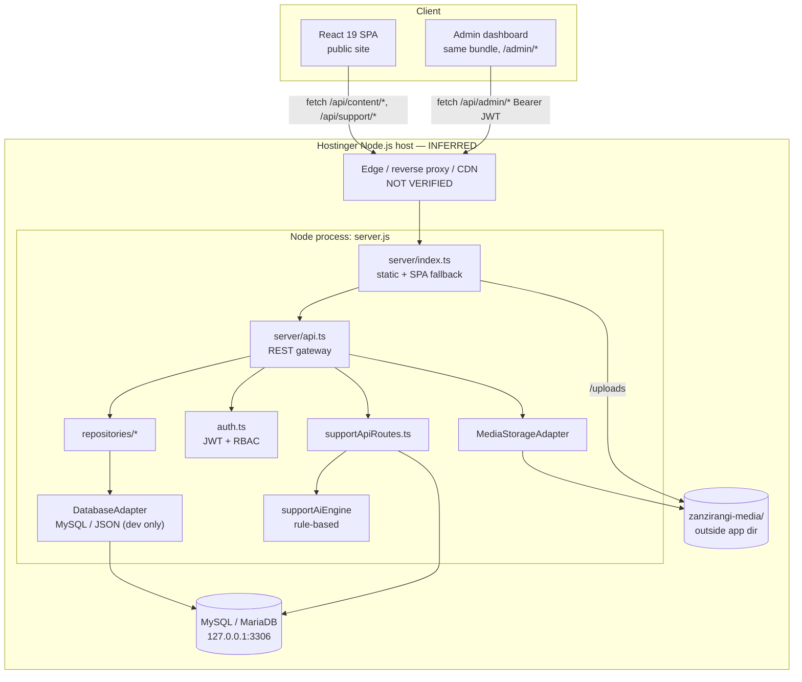
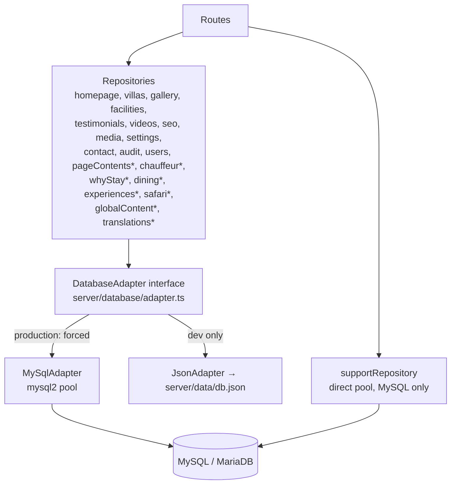
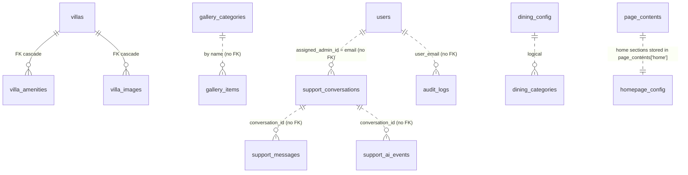
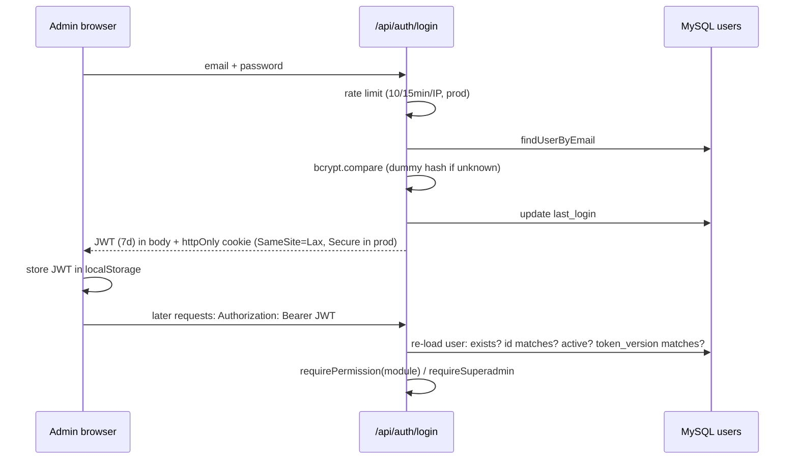

# Zanzirangi System Architecture

| | |
|---|---|
| Audit date | 2026-10-01 |
| Revision | `main` @ `2379f82` + uncommitted working tree |
| Companion | `ZANZIRANGI_PROJECT_BRIEF.md` |
| Labels | VERIFIED · PARTIALLY VERIFIED · INFERRED · NOT VERIFIED · NOT FOUND · PLANNED |

This document describes the architecture **as implemented**. Hosting-side facts (DNS, SSL, CDN, Node version on host) could not be verified from the repository and are marked accordingly.

---

## 1. Architectural Style

A **single-process, same-origin monolith** (VERIFIED):

- One Express 5 application (`server/index.ts`, bundled to `server.js`) serves:
  1. the compiled React SPA (`dist/`) and pre-rendered route HTML,
  2. uploaded media (`/uploads`),
  3. a JSON REST API (`/api/*`, defined in `server/api.ts` and `server/supportApiRoutes.ts`).
- The same `apiApp` is mounted into the Vite dev server in development (`vite.config.ts:11-22`), so dev and prod share one API implementation.
- No microservices, queues, caches (Redis), background workers or external APIs are used by the server.

---

## 2. Frontend

| Aspect | Implementation | Label / Evidence |
|---|---|---|
| Framework | React 19 + TypeScript | VERIFIED `package.json` |
| Build tool | Vite 6, `@vitejs/plugin-react`, Tailwind CSS 4 plugin | VERIFIED `vite.config.ts` |
| UI system | Tailwind utility classes, custom CSS variables (`src/index.css`), separate admin theme (`src/admin/admin-theme.css`, untracked), `lucide-react` icons, `motion` animations, Google Fonts (Cormorant Garamond, Plus Jakarta Sans) | VERIFIED |
| Routing | **Custom**: `currentPath` state from `window.location.pathname`, `history.pushState`, `popstate` listener (`src/App.tsx:188-370`). Admin = any path beginning `/admin`; tab = `/admin/<tab>` | VERIFIED |
| State management | React `useState/useEffect/useMemo` in `App.tsx`, props drilling; `ThemeContext`; localStorage for theme, language, admin token, chat visitor id | VERIFIED |
| Data access | `src/services/contentApi.ts` (public + admin content), `authApi.ts`, `supportApi.ts`; static fallback data in `src/data/*` | VERIFIED |
| i18n | 8 languages; static UI dictionaries + CMS translations from `/api/content/translations/:lang` applied by `src/i18n/cmsTranslations.ts` (untracked) | VERIFIED |
| Code splitting | **None** — one 1.73 MB JS chunk including admin | VERIFIED (build run 2026-10-01) |
| SEO runtime | Per-route `<title>`, meta, OG, canonical updated in `App.tsx:382-443`; `scripts/generate_routes.js` copies `index.html` per route with route-specific meta | VERIFIED |

### Public routes
`/`, `/villas`, `/dining`, `/experiences`, `/safari`, `/about`, `/contact`, `/privacy`, `/terms`. Any other non-admin path renders the shell without content (no 404 view).

### Admin views (`/admin/<tab>`)
`dashboard, support, homepage, pages, transfers, whystay, dining, experiences, safari, global, translations, admin-access, rooms, gallery, videos, facilities, testimonials, contact, seo, media, settings` (`src/App.tsx:518-563`). Unauthenticated → `AdminLogin`. Navigation hidden per permission (`AdminLayout.tsx:81-92`); authorisation enforced server-side.

---

## 3. Backend

| Aspect | Implementation | Evidence |
|---|---|---|
| Runtime | Node.js (`engines >=20`); local audit machine Node 24.16; CI Node 22; host version NOT VERIFIED | `package.json:5-7` |
| Framework | Express 5 | `package.json` |
| Entry | `server/index.ts` → esbuild → `server.js` (ESM, packages external) | `package.json:15` |
| Bind | `0.0.0.0:${PORT||3000}`; `ZANZIRANGI_NO_LISTEN=1` for embedded tests | `server/index.ts:122-133` |
| Startup lifecycle | validate env (fail fast in prod) → listen → connect DB with retry/backoff (5s × attempt, max 60s) → `/api/health` reports 503 until ready | `server/index.ts:11-139` |
| Shutdown | SIGTERM/SIGINT → close HTTP → close pool → exit; 10 s forced-exit timer; `uncaughtException` triggers shutdown | `server/index.ts:141-178` |
| API architecture | REST/JSON, `{ success, data, error }` envelope; JSON 404 and error handler for `/api/*` | `server/api.ts:1641-1659` |
| Middleware order (API) | security headers → CORS (credentials) → cookie-parser → JSON body (≈1.4× upload limit) → urlencoded → routes → 404 → error handler | `server/api.ts:53-74` |
| Static serving | `/uploads` (persistent dir + legacy `./uploads`) with `nosniff`, sandbox CSP, `no-cache`; `/assets` 1 y immutable; `dist/` with HTML `no-cache`; SPA fallback serving pre-rendered `dist/<route>/index.html` when present | `server/index.ts:32-95` |
| Authentication | `server/auth.ts` (see §5) | VERIFIED |
| AI/Support engine | `server/services/supportAiEngine.ts` — regex rules → knowledge-base substring match → keyword FAQ → human hand-off; fixed confidence values; no external LLM | VERIFIED |

### API surface (VERIFIED — `server/api.ts`, `server/supportApiRoutes.ts`)

| Group | Endpoints | Guard |
|---|---|---|
| Health | `GET /api/health` | public |
| | `GET /api/health/database` | superadmin |
| Auth | `POST /api/auth/login` (rate-limited), `POST /api/auth/logout`, `GET /api/auth/me` | public / public / JWT |
| Public content (GET) | `/api/content/` `homepage, villas, gallery, facilities, testimonials, videos, seo, contact, settings, pages, pages/:id, home-sections, translations/:lang, chauffeur, whystay, dining, dining/categories, experiences, safari, global` | public, read-only |
| Admin content | `homepage`, `contact-info`, `villas[/:id]`, `gallery[/:id]`, `facilities[/:id]`, `testimonials[/:id]`, `videos`, `seo`, `media[/:id]`, `settings`, `pages[/:id]`, `translations/:lang`, `home-sections`, `chauffeur`, `whystay`, `dining`, `dining/categories[/:id]`, `experiences[/:id]`, `safari[/:id]`, `global` | JWT + module permission |
| Media upload | `POST /api/admin/media/upload` | JWT only (**no `media` permission check**) |
| Users | `GET/POST /api/admin/users`, `GET/PUT /api/admin/users/:id`, `POST …/disable`, `…/enable`, `…/reset-password` | superadmin |
| Dashboard / audit | `GET /api/admin/dashboard-stats` (dashboard perm), `GET /api/admin/audit-logs` (superadmin) | |
| Support – visitor | `POST /api/support/conversation`, `GET /conversation/:id`, `POST /conversation/:id/messages`, `GET /conversation/:id/poll` | `visitor_id` ownership check; **no rate limit** |
| Support – admin | `/api/support/admin/` `conversations[/:id]`, `…/messages`, `…/status`, `…/suggested-reply`, `knowledge-base[/:id]`, `analytics` | JWT + `support` |

---

## 4. Data Layer

`*` = untracked (uncommitted) repository files.

| Aspect | Detail | Label |
|---|---|---|
| Engine | MySQL-compatible, InnoDB, utf8mb4 | VERIFIED (migrations); MySQL vs MariaDB on host NOT VERIFIED |
| Query layer | Raw `mysql2/promise` with `?` placeholders; no ORM; no user-controlled interpolation found | VERIFIED |
| Pool | `connectionLimit` (default 10), keep-alive, 15 s connect timeout, **no TLS option** | VERIFIED `server/database/connection.ts:43-55` |
| Schema files | `001_initial_schema.sql`, `002_support_system.sql`, `003_full_cms_coverage.sql` (untracked) | VERIFIED |
| Runtime DDL | `content_translations` table and `extras_json` columns created by the adapter | VERIFIED `mysqlAdapter.ts:1898,1935` |
| Migration strategy | Manual per-file scripts; `schema_migrations` written, never consulted; server only checks `homepage_config` exists | VERIFIED |
| JSON adapter | Dev only; blocked in production by env validation and adapter factory | VERIFIED |

### Entities and relationships

Singletons: `site_settings`, `contact_settings`, `homepage_config`, `video_storyboard`, `chauffeur_config`, `why_stay_config`, `dining_config`, `global_content`. Lists: `hero_slides`, `homepage_sections`, `villas`, `gallery_items`, `facilities`, `testimonials`, `video_items`, `seo_routes`, `media_assets`, `experiences`, `safari_destinations`, `dining_categories`, `support_*`, `content_translations`, `audit_logs`, `users`.

---

## 5. Authentication & Authorisation

- Revocation: `token_version` bumped on logout, disable, enable, password reset and role/status/permission change.
- Roles: `superadmin` (all), `admin` (17 assignable module keys). Max 6 active admins. Last active superadmin protected.

---

## 6. Media Storage

| Aspect | Detail |
|---|---|
| Adapter | `HostingerMediaStorage` (prod) / `LocalMediaStorage` (dev) — `server/storage/*` |
| Location | `MEDIA_STORAGE_PATH`, default `<domain>/zanzirangi-media` derived from Hostinger `hbuilds/versions/<id>` path; falls back to `./uploads` if unwritable (that fallback is **inside** the deploy folder and would be lost on redeploy) |
| Upload transport | base64 inside JSON (`POST /api/admin/media/upload`) |
| Validation | extension allow-list, MIME/extension match, magic-byte signature check, size ≤ `MAX_UPLOAD_SIZE` MB (default 25), sanitized + randomised filename, resolved-path containment check |
| Serving | `express.static` at `/uploads` with `nosniff`, sandbox CSP, `Cache-Control: public, no-cache` |
| Image processing | none (no resizing/format conversion) |

---

## 7. Infrastructure

| Item | Value | Label |
|---|---|---|
| Hosting provider | Hostinger (Node.js web app via hPanel) | INFERRED (code comments `server/index.ts:28,36`; `env.ts:48-55`; docs) |
| Domain | `zanzirangihouse.com` | Configured in code; registration/DNS NOT VERIFIED |
| SSL / HTTPS | HSTS emitted on API responses in production; `Secure` cookies in production; certificate NOT VERIFIED | PARTIALLY VERIFIED |
| CDN | Code comment states Hostinger's CDN rewrites CSP on uploads and caches media | INFERRED (`server/index.ts:36-39`) |
| DNS dependencies | NOT VERIFIED |
| Port | `PORT` from platform; default 3000 | VERIFIED |
| Process manager | Hostinger runtime (Passenger referenced in commit `adab9b8`) | INFERRED |
| Email infrastructure | NOT FOUND |
| Storage | Local disk on host | VERIFIED (code) |
| Database hosting | Hostinger MySQL on same server (`127.0.0.1`) | INFERRED (`.env.example`) |
| CI/CD | GitHub Actions → **GitHub Pages** static build only; no pipeline to Hostinger | VERIFIED |

---

## 8. Build & Release

| Step | Command | Output |
|---|---|---|
| Client build | `vite build` | `dist/index.html`, `dist/assets/*` (hashed) |
| Route pre-render | `node scripts/generate_routes.js` | `dist/<route>/index.html` with route meta |
| Server bundle | `esbuild server/index.ts --bundle --platform=node --format=esm --packages=external --outfile=server.js` | `server.js` (committed to git) |
| Package | `npm run package:hostinger` | `hostinger_deploy.zip` (dist, server.js, package*.json, public, uploads, .env.example) with secret scan |
| Deploy | Manual upload + hPanel Node.js setup | — |

---

## 9. External Integrations

| Integration | Mechanism | Server-side? |
|---|---|---|
| Google Maps | iframe embed + share link | No |
| Google Fonts | CSS link | No |
| WhatsApp | `wa.me` links | No |
| Unsplash | image URLs | No |
| Gemini (`@google/genai`) | dependency only — **unused** | No |
| Analytics / email / payments / OTA / CRM | **NOT FOUND** | — |

---

## 10. Known Architectural Constraints

1. Single process, single host: no horizontal scaling; the in-memory rate limiter is per-process.
2. Chat uses HTTP polling (no WebSockets/SSE).
3. All content is client-rendered; pre-rendered HTML holds metadata only.
4. Media uploads are base64-in-JSON (≈33 % overhead, memory-bound).
5. Manual schema migrations; runtime DDL in the adapter.
6. No staging tier; development currently configured against a remote database.
